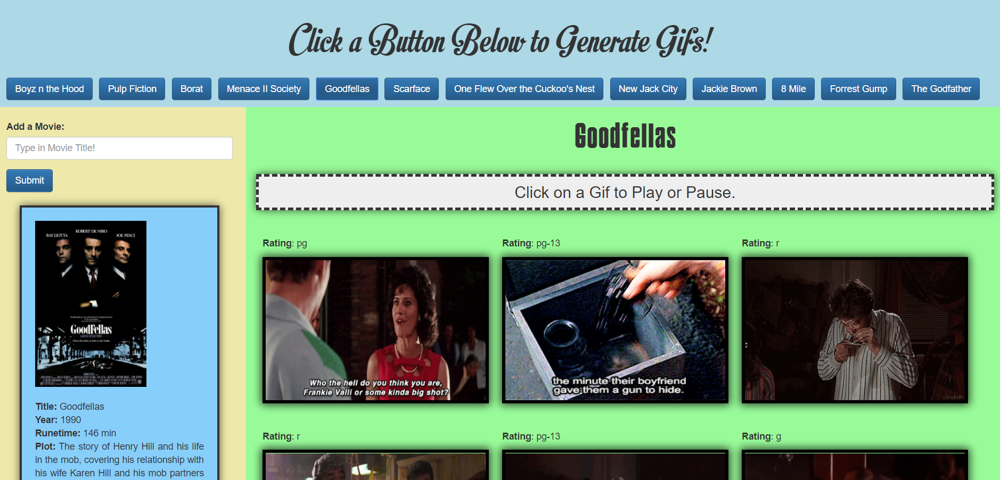

# API/Ajax Movie Gif Application

 [View Live!](https://bereznd1.github.io/Movie-GIF-Retrieval/) 

## Brief Description

The **API/Ajax Movie Gif Application** allows users to click on a button that is labeled with a movie title, which then displays (using an **Ajax call** to the **GIPHY API**) a set of gifs related to that movie that users can click to play and click again to pause. The app also calls the **OMDB API** to display cinematic information about that movie, such as the movie poster, plot, and runtime. Users can request extra movies to choose from in addition to the preset films available upon page load by entering the film they desire into the search form, and a button with that film's title will be added to the existing array of buttons.

## How This Was Achieved

First, I set up an array of strings, each string being the name of one of my favorite movies. I then created a function which loops through this array and generates a button for each item. This function is called upon page load to populate the top of the page with buttons for each film in the array. 

Next, I set up a function that is activated when one of these buttons is clicked. This function sets up a variable called *movieName* that uses **jQuery** to get the movie-name attribute of the specific button that was clicked (this attribute was set up in the previous function to be equal to the movie title). The function then makes an **Ajax call** to the **GIPHY API**, using the value of the movieName variable in the query url in order to generate 9 gifs that are related to the movie in question. The function then loops through the array of returned gifs and displays on the page the still version of each gif, as well as the value of its rating parameter, while making sure that each gif can be clicked to play and clicked again to pause. This last part is achieved through assigning each gif custom attributes that store that gif's "still" url & its "animated" url, which are then toggled using a click event and a set of **If-else statements**. 

Next, an Ajax call is made to the OMDB API to acquire cinematic information on the movie that is currently selected, such as that movie's official title, runtime, plot, and poster, and all of that information is displayed on the left side of the page underneath the search bar. 

Another function is created, which appends a button with the text "Load More Gifs!" to the bottom of the current set of gifs. This button makes a call to the GIPHY API once again to retrieve the next set of 9 gifs related to the movie that is currently selected and display those gifs at the bottom of the page. This button can keep being clicked by the user to retrieve more gifs. 

Finally, a function is created which is activated when a user types something into the search form on the left side of the page and hits submit. This function takes the value of what the user typed in, adds that string to the original array of topics, and then runs the *makeButtons* function in order to iterate through the array once more and create a button for the new movie. 

